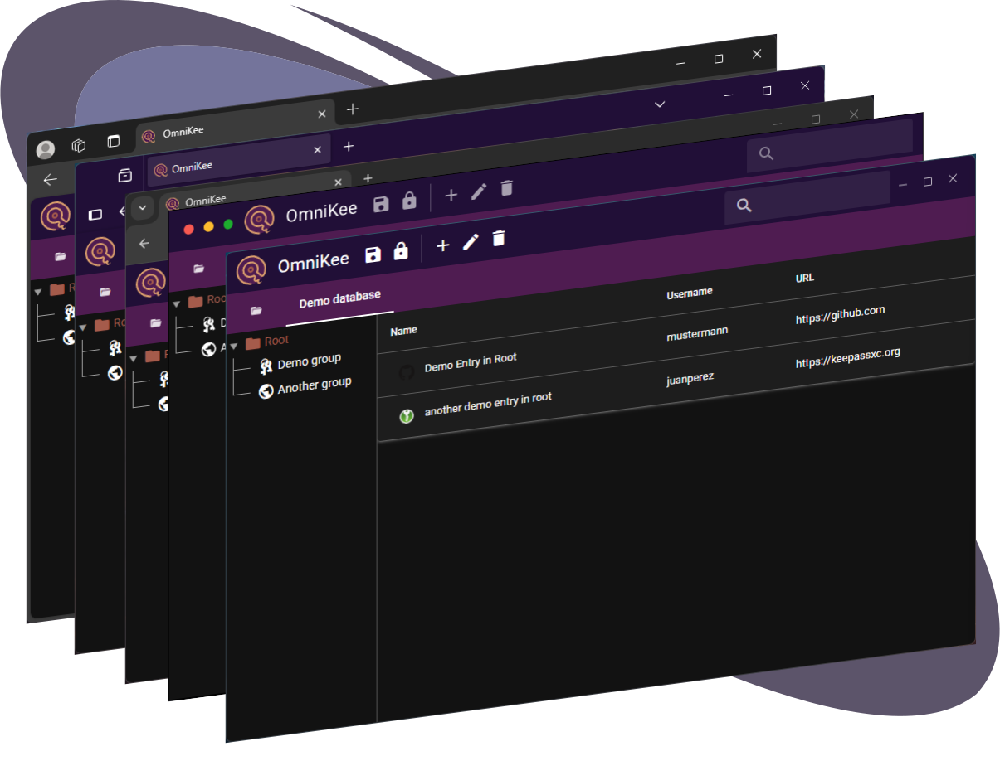

+++
title = "A KeePass client that runs anywhere"

# The homepage contents
[extra]
lead = '<b>OmniKee</b> is a cross-platform <a href="https://keepass.info/">KeePass</a> client built using memory-safe languages that runs on Windows, MacOS, Linux, Android, and your browser. 

'
url = "/docs/getting-started/introduction/"
url_button = "Get started"
repo_version = "GitHub project"
repo_license = "Open-source AGPL 3.0 License."
repo_url = "https://github.com/omnikee/omnikee"

# Menu items
[[extra.menu.main]]
name = "Docs"
section = "docs"
url = "/docs/getting-started/introduction"
weight = 10

[[extra.menu.main]]
name = "Launch"
section = "launch"
url = "/launch"
weight = 20

[[extra.list]]
title = "Cross-platform 🌈"
content = 'Native Linux, Windows, and Android apps powered by <a href="https://v2.tauri.app">Tauri</a>. Browser-based deployment powered by <a href="https://github.com/rustwasm/wasm-pack">wasm-pack</a>'

[[extra.list]]
title = "Lightweight 🪶"
content = 'Not an Electron app &mdash; uses system-native browser window for smaller packages and better memory efficiency'

[[extra.list]]
title = "Secure 🔐"
content = "Databases are handled in safe Rust backend. Clear separation of UI and data handling."

+++
